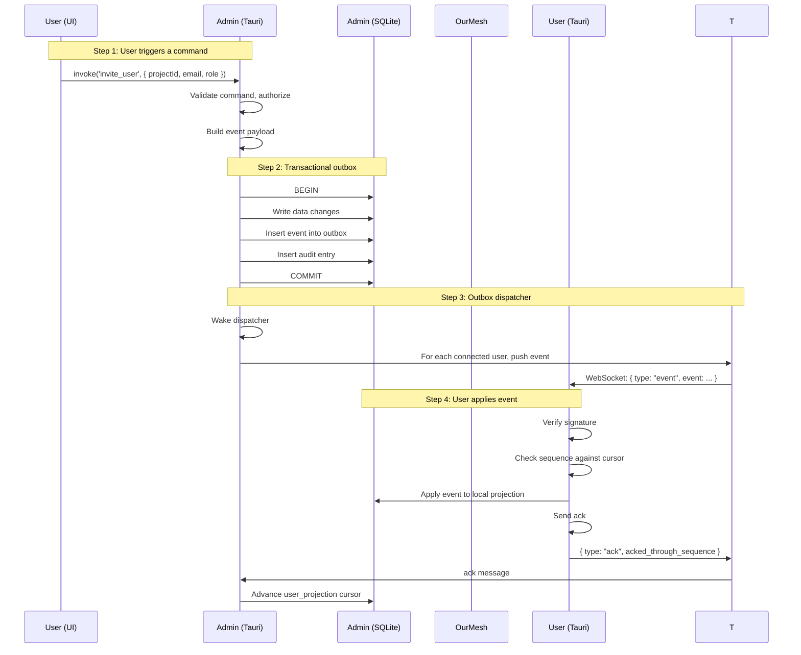
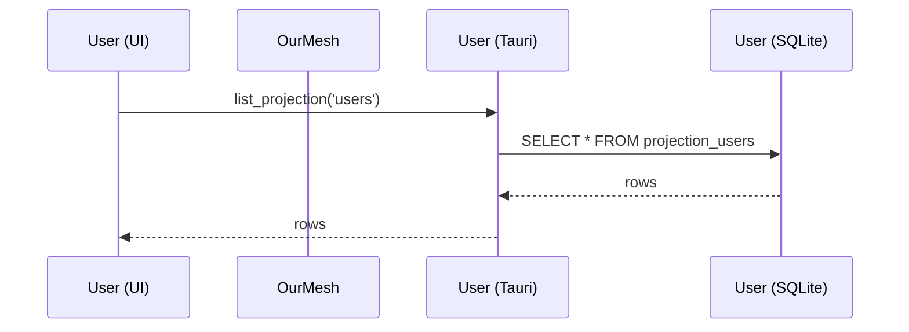

# TASK ID: ARCHITECTURE-001.1
# TITLE: Add data flow diagram (Mermaid)
# STATUS: pending
# DEPENDENCIES: COMMUNICATION-001.4
# ALLOWED FILES: /workspace/docs/architecture/02-DECISIONS/DATA-FLOW.md
# FORBIDDEN FILES: any other file
# OWNER: any
# ESTIMATED EFFORT: 3 minutes

## OBJECTIVE
Document the data flow from User action → Admin command → event → projection → User view.

## REQUIRED IMPLEMENTATION

Create `/workspace/docs/architecture/02-DECISIONS/DATA-FLOW.md`:

```markdown
# Data flow

The end-to-end flow of a single command from a User pressing a button in the Admin UI to the event being projected to all connected Users.

## Sequence



## Failure modes

### Admin crashes between BEGIN and COMMIT

- Transaction rolls back; no event in outbox; no audit entry
- User retries; sees no state change; no harm done

### Admin crashes between COMMIT and outbox dispatch

- Event is in the outbox but not yet dispatched
- On restart, the dispatcher reads the outbox and dispatches missing events
- Users receive the event on reconnect (idempotent)

### Our mesh connection drops mid-dispatch

- User's read task sees the disconnect, auto-reconnect
- On reconnect, the User requests `sync_request` for the latest sequence
- Admin sends the missing events

### User crashes mid-apply

- User's projection may be in an inconsistent state
- On restart, User checks the cursor against the local projection
- If inconsistent, requests a full snapshot

### Admin and User have different views

- The Admin is always the source of truth
- The User's projection may be temporarily stale
- A snapshot is forced if the gap is > 5,000 events or 7 days

## Latency targets

| Step | Target |
|------|--------|
| User clicks button → admin receives | < 50ms (loopback) |
| Admin writes to SQLite (commit) | < 30ms |
| Admin dispatches to 10 Users | < 100ms |
| User receives event | < 50ms |
| User applies to projection | < 30ms |
| User UI updates | < 50ms |
| **Total** | **< 350ms p99** |

## Read path (no write)



Read path is purely local to the User. No round trip to Admin, no Cloud.

## Why this design

- **Local-first**: The User is fully functional with a stale view; the Admin is the only thing that needs to be online for writes
- **One writer**: The Admin is the single source of truth; no coordination needed between Admins
- **Pull-based with push accelerator**: Users can pull on demand, or be pushed to
- **Idempotent**: All events are idempotent; replay is safe
- **Bounded lag**: The 5K/7d gap threshold forces a snapshot if the User is too far behind
```

## TESTS

```bash
cd /workspace
test -f docs/architecture/02-DECISIONS/DATA-FLOW.md || { echo "FAIL"; exit 1; }
grep -q "Data flow" docs/architecture/02-DECISIONS/DATA-FLOW.md || { echo "FAIL"; exit 1; }
grep -q "sequenceDiagram" docs/architecture/02-DECISIONS/DATA-FLOW.md || { echo "FAIL: no diagram"; exit 1; }
echo "OK"
```
